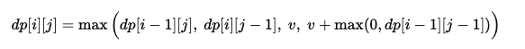

- [1458. 两个子序列的最大点积](https://leetcode.cn/problems/max-dot-product-of-two-subsequences/description) 动态规划
    - 对于每个pair [i,j]有四种可能:
        - 作为子序列的首个 `nums1[i]*nums2[j]`
        - 加入之前的子序列 `0 + max(0, dp[i-1][j-1])` 注意如果之前的最小是负数，不如不要
        - 跳过其中一个: `dp[i-1][j]` 或者 `dp[i][j-1]`
    - 状态转移方程:
    
    - 初始化dp数组: `dp[0][0]` 开始 返回 `dp[m-1][n-1]`
        - `Arrays.fill(array,val)`